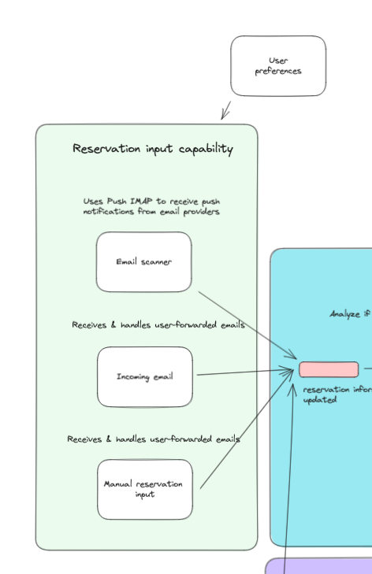
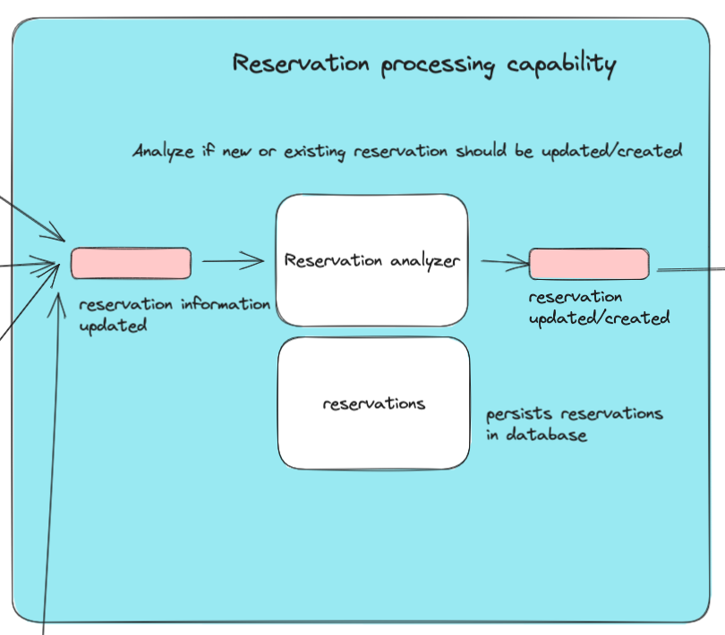
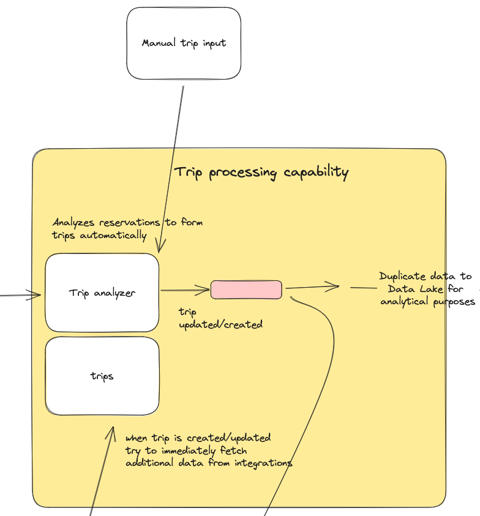
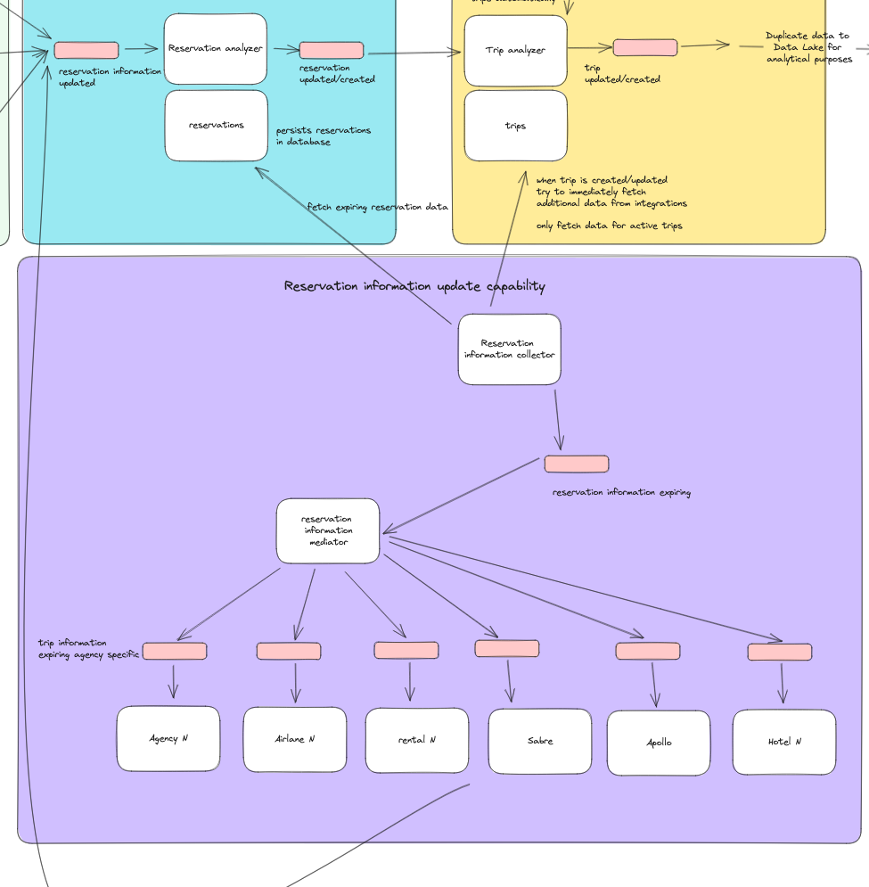
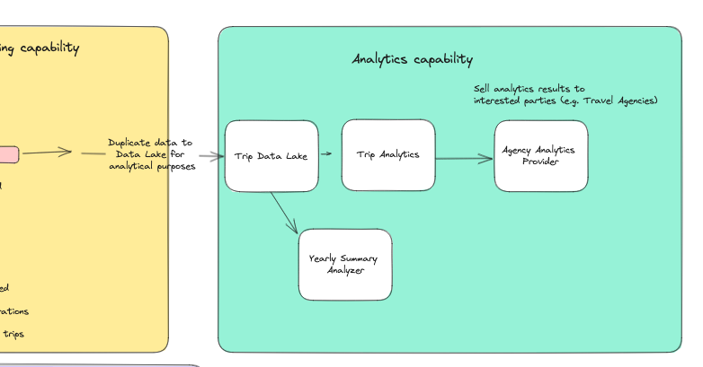
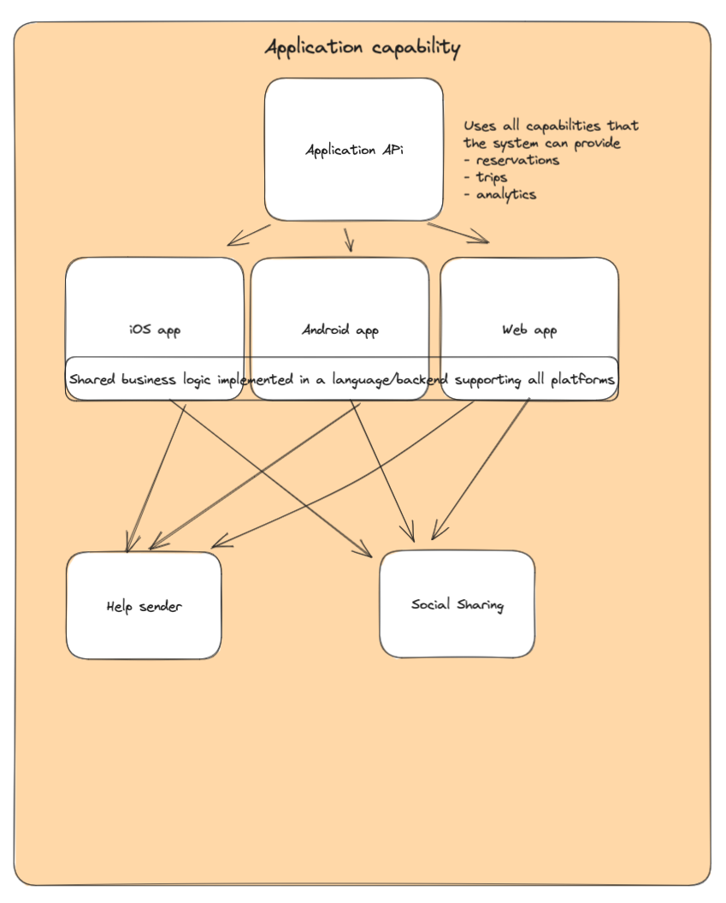

# Architectural Kata: Spring 2023: Road Warrior

## Introduction

This document describes a solution proposal for O'Reilly Architecture Katas 2023 called Road Warrior.

## Team & Members

Team Konttilonkero (origins from Finnish language and translates to "container of tentacles")

- Jani Rotola-Pukkila
- Joonas Pessi
- Jussi Haapanen
- Markus Salmi
- Mika Koikkalainen

## Problem Analysis / Business Case

### Goal

Design an online trip management application to allow travellers to see all of their existing reservations organised by trip either online (web) or through their mobile device.
2 million active users/week
total users: 15 million (user accounts)

### Business requirements

- Poll email, looking for travel-related emails
- Filter and whitelist certain emails
- The system must interface with the agency’s existing airline, hotel, and car rental interface system to update travel details (delays, cancellations, updates, gate changes, etc.).
- Updates must be in the app within 5 minutes of an update (better than the competition)
- Customers should be able to add, update, or delete existing reservations manually as well.
- Items in the dashboard should be able to be grouped by trip, and once the trip is complete, the items should automatically be removed from the dashboard.
- Users should also be able to share their trip information by interfacing with standard social media sites or allowing targeted people to view your trip.
- Richest user interface possible across all deployment platforms
- Provide end-of-year summary reports for users with a wide range of metrics about their travel usage
- Road Warrior gathers analytical data from user’s trips for various purposes - travel trends, locations, airline and hotel vendor preferences, cancellation and update frequency, and so on.

### Additional context

- Must integrate seamlessly with existing travel systems (i.e., SABRE, APOLLO)
- Must integrate with a preferred travel agency for quick problem resolution (help me!)
- must work internationally

### Technical requirements

- Users must be able to access the system at all times (max 5 minutes per month of unplanned downtime, roughly 99.99% uptime)
- Travel updates must be presented in the app within 5 minutes of generation by the source
- Response time from web (800ms) and mobile (First-contentful paint of under 1.4 sec)

## Solution

### Driving characteristics

We used [architecture characteristis worksheet](https://developertoarchitect.com/resources.html) to evaluate the driving characteristics of the system. As a result we identified the following characteristics as the most important ones:

#### Scalability

With 2 million active users per week and a total of 15 million user accounts,
the system needs to be able to handle a large volume of concurrent events and requests.
The system should be able to scale horizontally to handle the load as it might be quite
expensive to scale vertically by increasing only instance sizes.

#### Elasticity

Elasticity is the ability of a system to adapt to changes in demand.
A service with 2 million active users is likely to experience significant changes in demand, both in terms of the number of users and the amount of traffic generated by those users.
For example, the service might experience spikes in traffic during peak hours or on holidays. It is important for the service to be able to handle these changes in demand without compromising performance or availability.

Here are some specific benefits of elasticity for a service with 2 million users:

- Improved performance: Elasticity allows you to scale up the resources available to the service during peak traffic times, which can help to improve performance and prevent latency issues.
- Increased availability: Elasticity can help to ensure that the service is always available, even if there is a sudden increase in demand. This is because you can quickly scale up the number of resources available to the service to meet the demand.
- Reduced costs: Elasticity can help to reduce costs by allowing you to only pay for the resources that you need. This is in contrast to a traditional monolithic architecture, where you would need to provision a fixed number of resources, even if you were not using them all.

#### Extensibility

Extensibility is the ability of a system to be modified or extended to accommodate new features or changes. This is important for a service with integrations to multiple systems because it allows the service to adapt to changes in those systems without having to be completely redesigned. It makes integrating new system as easy as possible.

#### Responsiveness

Responsiveness is the ability of a system to respond to requests in a timely manner. This is important for a service with 2 million active users because it ensures that users can interact with the service without having to wait too long. There are thight requirements for being able to deliver reservation
updates within 5 minutes of generation by the source. In addition to this we are aiming for 800ms response time from web and 1.4s from mobile.

### Architecture Analysis

Following chapter will define the chosen architecture style and the main capabilities of the system.

#### Architecture style

We decided to use event driven architecture as the main architecture style for the system. This architecture style is well suited for the driving characteristics of the system. It allows for asynchronous processing of events and requests, which will help to improve performance and prevent latency issues. It also allows for the system to be scaled horizontally to handle the load as it might be quite expensive to scale vertically by increasing only instance sizes. In addition to this, event driven architecture is well suited for integrating with multiple systems because it allows for the system to be modified or extended to accommodate new features or changes for example by using a mediator pattern for separate 3rd party integrations.

Event driven architecture logically splits the system into smaller sub-system which makes it possible to implement these components as separate microservices (microservice pattern). This will help to improve scalability and extensibility of the system.

### General architecture

Here is an overview of general architecture

From the diagram we can see that the system is divided into main capabilities:

- reservation input capability
- reservation processing capability
- trip processing capability
- reservation information update capability
- analytics capability
- application capability

#### Reservation input capability

This capability is responsible for receiving reservation information from different sources. These source can be user email (email scanner), user forwarded emails (incoming emails) or manually inputted reservation (manual reservation input). All of these events will generate an event into
the 'reservation information updated' event queue.

At this point, reservation input capability does not have any context of the reservation itself. It only knows that there is a new reservation information available. This is done to decouple the reservation input capability from the reservation processing capability. As there can be multiple more reservation input system, it is important that the reservation processing capability does not need to know about the reservation input system. It also allows for the reservation processing capability to be scaled independently from the reservation input capability.

Reservation input capability might also need some additional user preference information to be able to process the reservation information. This information can be fetched from the user profile service.

#### reservation processing capability

Reservation processing capability is responsible for processing the reservation information and persisting reservations. It will fetch new reservation information from `the reservation information updated` event queue and process it. This capability will determine if existing reservations needs to be updated or if new reservations needs to be created. It will also determine if the reservation information is valid and if it is not. Finally, It will generate an event into `reservation updated/created` event queue on successful update/create.

Reservations itself does not have any context of the trip. It only knows that it is a reservation. This is done to decouple the reservation processing capability from the trip processing capability.

It also offers an API and database for fetching reservations.

#### trip processing capability

Trip processing capability is responsible for grouping reservations into trips. It will fetch new reservation information from `reservation updated/created` event queue and process it. It will determine if the reservation belongs to an existing trip or if a new trip needs to be created. It will also determine if the reservation information is valid and if it is not. Finally, It will generate an event into `trip updated/created` event queue on successful update/create.

#### reservation information update capability

Reservation information update capability is responsible for updating reservation information in active trips. This is one of the most time critical functions of the system. It needs to be able to update the trip information within 5 minutes.

Reservation information collector, will fetch active trips and their corresponding reservations. Note that we assume that we have only "poll" based APIs available and agencies do not support "push" based integrations in most cases. Reservation information collector will then generate an event into `reservation information expiring` event queue.

From this event queue `reservation information mediator` will fetch the expiring reservation information and assign it to the Agency specific event queue. This mediator patterns allows us to individually scale the reservation information mediator for each 3rd party integration. This will also minimize the possibility that broken integrations would affect the whole system.

Then 3rd integration is responsible for fetching the reservation information from the agency. It will then generate an event into `reservation information updated` event queue, which will be handled by the reservation processing capability.

#### Analytics capability

Analytics capability is responsible to calculate aggregates from the reservation and trip information. This data can be offered to the user through the API or it can be used for internal purposes.

Analytics capability can be also used to calculate overall reservation trends and to predict future trends. This data can be used to improve the user experience and to offer better recommendations for the user. And also for the agency to improve their services.

#### Application capability

Application capability is responsible for offering the user interface for the user. Application capability will use its own backend service which will connect to the reservation, trip and analytics capabilities. It will also use the user profile service to fetch user preferences.

User clients will be built separate for each major platforms (web, iOS, Android). This will allow us to offer the best possible user experience for each platform. It will also allow us to use the native features of each platform.

At this point social media integrations are included as a part of application capability. This is because we assume that the social media integrations are mainly targeted for application users.
If social media integrations becomes too complicated, they might be moved to a separate capability.

